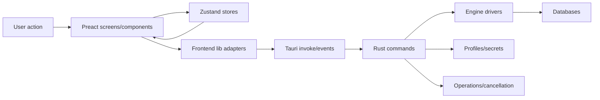

# PoliteDB Architecture

PoliteDB is a local-first Tauri v2 desktop database client. The frontend is a Preact/Vite/TypeScript application in `src/`; the native backend is Rust in `src-tauri/`.

## Runtime Shape

## Frontend Boundaries

- `src/screens/` owns screen-level composition and workflows.
- `src/components/` owns reusable UI and feature UI.
- `src/hooks/` owns reusable frontend behavior and orchestration.
- `src/stores/` owns shared client state, row windows, patches, filters, sorting, SQL results, and active connection state.
- `src/lib/` owns typed service helpers: Tauri wrappers, query builders, table loading, patch SQL generation, editor helpers, updater helpers, and engine-specific frontend utilities.
- `src/utils/` owns small pure helpers shared across features.

Keep rendering, state orchestration, query generation, and Tauri I/O separate. When a screen grows, move focused logic into hooks or `src/lib/` helpers rather than adding more unrelated logic to the screen component.

## Backend Boundaries

- `src-tauri/src/commands/` exposes Tauri command handlers.
- `src-tauri/src/engines/` owns engine dispatch, connection behavior, SQL classification, CSV import, cancellation, profile secret persistence, and per-engine adapters.
- `src-tauri/src/profiles/` owns profile storage, validation, import/export, migration, and encrypted sharing.
- `src-tauri/src/security/` owns keychain and security-sensitive native helpers.
- `src-tauri/src/operations/` owns long-running operation execution and progress/cancel coordination.
- `src-tauri/src/ssh_tunnel/` owns SSH tunnel lifecycle.

Tauri commands should stay thin: validate inputs, call a focused service or engine adapter, and return DTOs suitable for frontend state. Avoid putting driver-specific behavior directly in command handlers.

## Table Data Flow

1. A table window is opened from the connection workspace.
2. `MainTableDataPane` and loading hooks derive pagination, filters, sort, and refresh intent.
3. `src/lib/table-data/` computes the load plan and calls engine-specific loaders.
4. SQL engines use query builders under `src/lib/queries/sql/`.
5. Row windows and table metadata are stored in `src/stores/connection/`.
6. UI reads rows through store selectors and applies pending patch overlays.

Table filters and sort are part of the data query contract. Any reload after save, discard, pagination, or navigation must preserve the applied filter/sort state unless the user explicitly clears it.

## Editing And Save Flow

1. Cell edits create patch entries in `dataPatchMap`.
2. UI renders pending changes over original rows.
3. Save collects changed windows and builds SQL via `src/lib/patches/` and `src/utils/generateSql`.
4. SQL engines execute statements through backend transaction helpers where supported.
5. Non-SQL engines route to focused patch adapters.
6. After success, patches are cleared and affected tables are reloaded.

Patch generation is security-sensitive. Preserve row identity, primary-key checks, virtual-key safety, destructive confirmations, and transaction behavior when modifying this flow.

## SQL Editor Flow

SQL editor windows are managed by the screen store and query runner hooks. The editor picks selected SQL/current statement, applies safety mode checks, executes via Tauri query commands, and stores result runs for the lifetime of the SQL window.

Query state must be scoped by connection/profile and database context so multiple databases in the same connection do not share editor cache or results.

## Security Rules

- Never log raw SQL, passwords, tokens, connection strings, file paths, database names, or customer data unless the surrounding code already masks them.
- Keep keychain, encrypted profile export/import, SSH, license activation, table edits, and destructive actions treated as sensitive paths.
- Prefer explicit unsupported-operation errors over best-effort SQL that may be unsafe.
- Keep analytics opt-in and never send raw SQL/query text.

## Verification

- Frontend-only changes: run `npm run build` and targeted Vitest tests when practical.
- Rust/Tauri changes: run relevant Rust checks/tests under `src-tauri/`.
- UI behavior changes: run the app or dev server and inspect the affected workflow when feasible.
- Document skipped verification and remaining risk in the handoff.
